Hi there

I’m Johan Sanneblad. I have a PhD in software development, and have the past decades created over 100 apps and services together with companies like Apple, Electronic Arts, Google, Lego, Microsoft, SKF, Volvo Cars, Yamaha and many others. I love creating small details in software applications and making applications that appear simple but have lots of thoughtful logic under the hood. 

I am the CEO of [TokenTek](https://www.tokentek.ai/), and I use Obsidian every day for my weekly AI newsletter [Tech Insights](https://www.techbyjohan.com/) and plan to support and develop [Notebook Navigator](https://notebooknavigator.com/) as long as there are people using it. Please feel free to connect with me on LinkedIn: [Johan Sanneblad](https://www.linkedin.com/in/johansan/)

